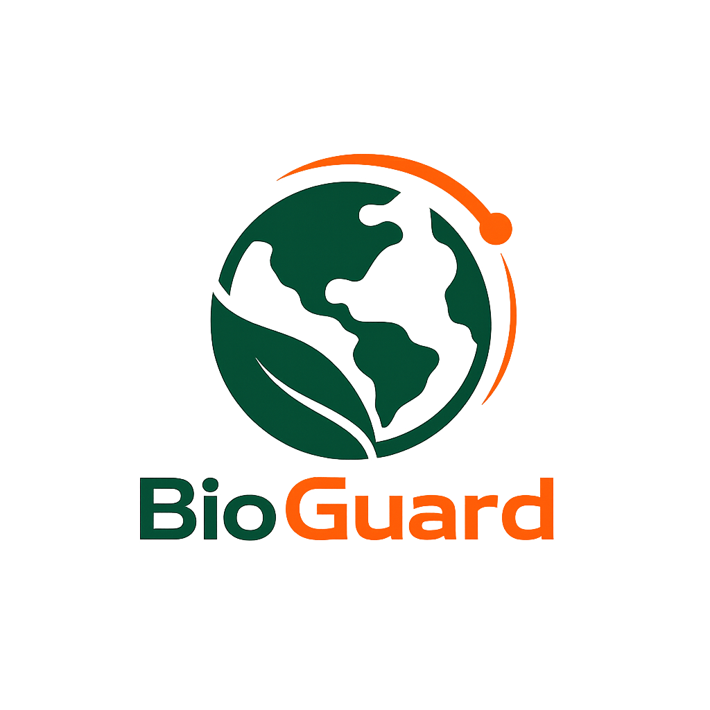

<p align="center">
  
</p>

# 🌎 BioGuard — Monitoramento Inteligente de Queimadas e Impacto na Fauna Brasileira

O **BioGuard** é uma solução de inteligência ambiental desenvolvida para monitorar focos de queimadas em tempo real e correlacionar esses eventos com o impacto direto na fauna brasileira, focando especialmente em espécies ameaçadas de extinção de acordo com a **IUCN Red List** (União Internacional para a Conservação da Natureza).

Este projeto foi originalmente concebido como parte da **FIAP Global Solution 2026**, com o propósito de demonstrar como a ciência de dados e a tecnologia geoespacial podem ser aplicadas diretamente na preservação da biodiversidade e na resposta rápida a desastres ambientais.

---

## 🚀 Funcionalidades Principais

- **🗺️ Mapa Interativo de Calor & Clusters:** Visualização dinâmica dos focos de incêndio ativos em todo o território nacional, utilizando dados geoespaciais de satélites do INPE.
- **🐾 Monitoramento de Espécies Ameaçadas:** Cruzamento geográfico inteligente entre as áreas afetadas por incêndios e os habitats críticos de espécies vulneráveis (VU), em perigo (EN) e criticamente em perigo (CR).
- **🧠 Índice de Vulnerabilidade Ambiental:** Algoritmo proprietário que calcula em tempo real o nível de risco (Baixo, Médio, Alto, Crítico) de cada bioma com base na densidade de queimadas e na severidade do status de conservação da fauna local.
- **📈 Dashboards Analíticos Avançados:** Gráficos interativos que detalham a distribuição de focos por bioma e a categorização IUCN das espécies sob ameaça.
- **📄 Relatório Ambiental Automatizado:** Geração de um sumário executivo em tempo real com métricas consolidadas pronto para exportação.
- **📥 Exportação de Dados:** Funcionalidade integrada para download dos dados filtrados em formato CSV.

---

## 🛠️ Stack Tecnológica

O projeto foi construído utilizando as ferramentas mais robustas do ecossistema Python para análise de dados e visualização interativa:

- **Linguagem:** Python 3.11+
- **Interface Web:** Streamlit
- **Visualização Geoespacial:** Folium & Streamlit-Folium
- **Gráficos Interativos:** Plotly Express
- **Processamento de Dados:** Pandas & NumPy
- **Análise Estatística & Agrupamento:** Scikit-Learn (K-Means)

---

## 📂 Estrutura do Projeto

Para facilitar a execução local e manter as boas práticas de desenvolvimento, o projeto está estruturado da seguinte forma:

```text
BioGuard/
│
├── logo.png                     # Logotipo oficial do projeto
├── app.py                       # Código-fonte da aplicação Streamlit
├── BioGuard.ipynb               # Notebook Jupyter com a análise exploratória e modelagem
├── requirements.txt             # Dependências e bibliotecas necessárias
│
├── bdqueimadas.csv              # Base de dados de queimadas (INPE)
├── dados_filtrados_bioguard.csv # Dados processados exportados
├── especies_monitoradas.csv     # Base local de espécies monitoradas
└── mapa.html                    # Mapa estático gerado para fins de backup/demonstração
```

---

## 💻 Como Executar Localmente

Siga o passo a passo abaixo para rodar a aplicação em sua máquina local:

### 1. Clonar o Repositório ou Extrair os Arquivos
Certifique-se de que todos os arquivos estejam extraídos na mesma pasta de trabalho.

### 2. Instalar as Dependências
Instale todas as bibliotecas necessárias:

```bash
pip install -r requirements.txt
```

### 3. Executar a Aplicação Streamlit
Para iniciar o servidor local e abrir a interface interativa no seu navegador, execute:

```bash
streamlit run app.py
```

O aplicativo será aberto automaticamente no endereço: `http://localhost:8501`

### 4. Executar o Jupyter Notebook (Opcional)
Se desejar explorar a análise de dados passo a passo e o desenvolvimento do algoritmo de agrupamento.


## 📊 Impacto e Relevância Social

A destruição de habitats por queimadas é uma das principais causas de perda de biodiversidade no Brasil. O **BioGuard** resolve um gargalo crítico: a **velocidade de resposta**. 

Ao cruzar dados de satélites espaciais com o mapeamento de habitats em um painel unificado, permitimos que órgãos de proteção ambiental, pesquisadores e ONGs identifiquem em minutos — e não em dias — quais ecossistemas e espécies estão sob ameaça iminente, otimizando o direcionamento de recursos e brigadas de incêndio.

